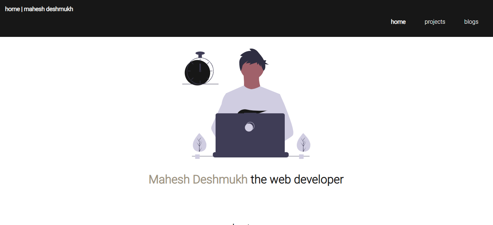

# my-portfolio
This is my web dev portfolio.  
This portfolio contains three sections:   
1.Home: My brief introduction.  
2.Projects: All my web development projects.  
3.Blogs: My blog listing page.   
